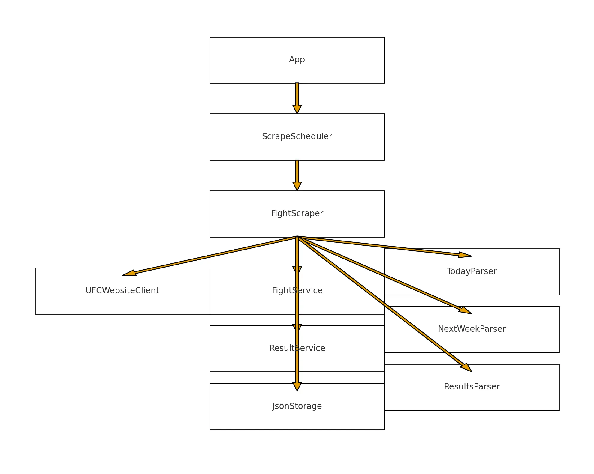

# UFC Scraper

## About this project

This project is a Java-based web scraper designed to automatically collect structured information about UFC events and fights. The scraper retrieves details about **today’s fights**, **recent fight results**, and **upcoming fights**, including fighters, weight classes, event names, dates, locations, and result breakdowns (winner, method, round, and time).

The system is built with a modular architecture consisting of a scraper core, HTML parsers, a service layer for processing data, and optional storage components for saving results as JSON or in a database. A scheduling component can automatically run the scraper at regular intervals, keeping fight information continuously up to date.

The goal of the project is to provide an extensible, reliable, and developer-friendly tool for tracking UFC fight data, suitable for automation, analytics, or integration with other applications.

## Proposed user journey

